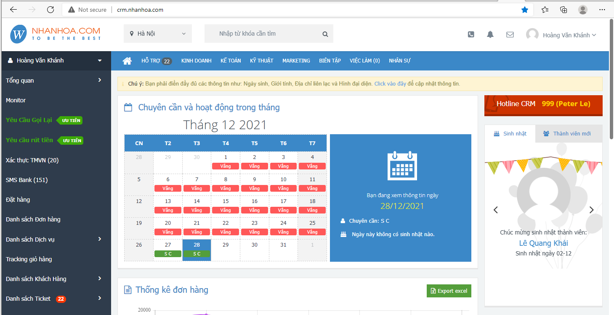
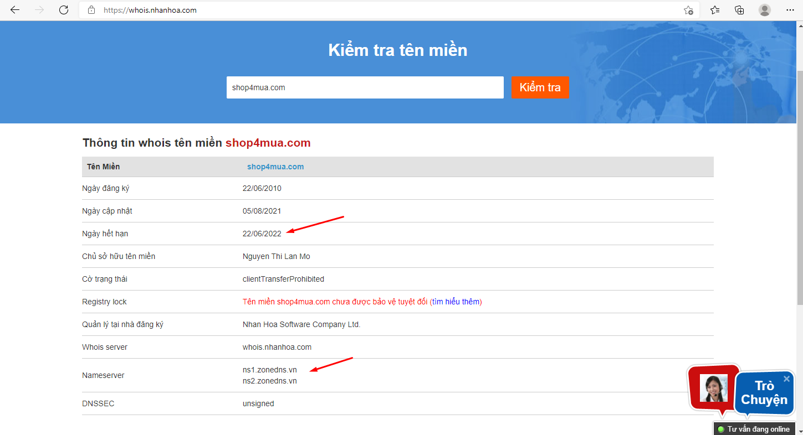
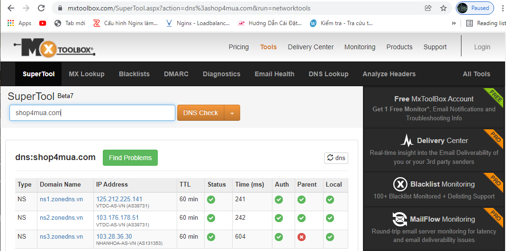
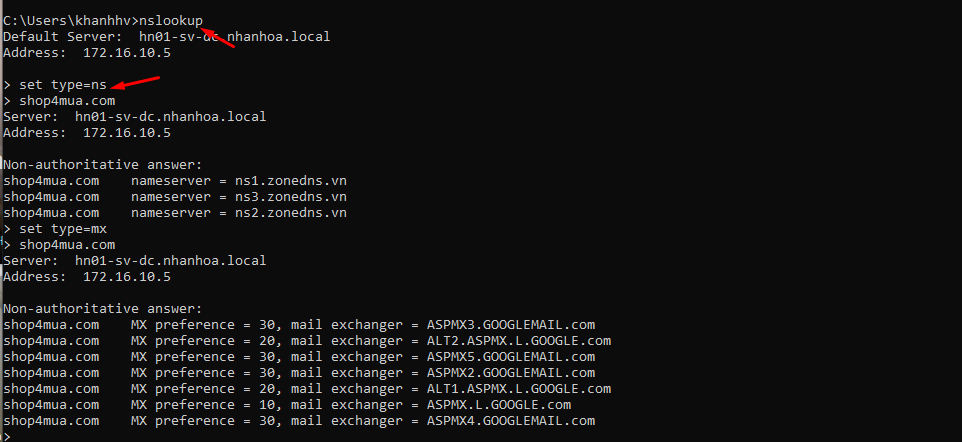
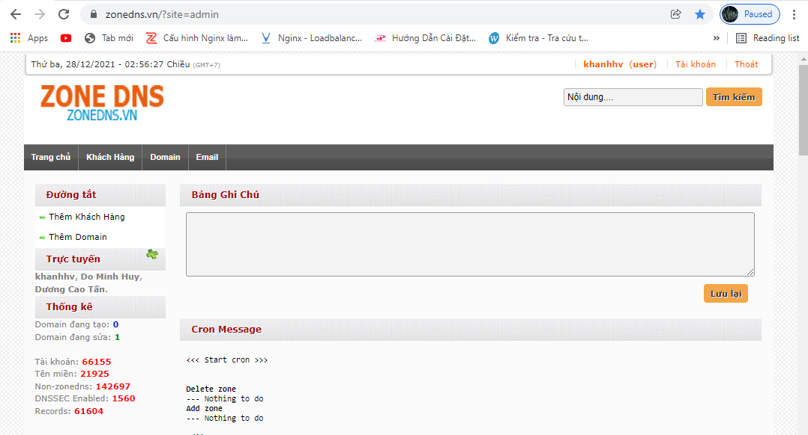

## Danh sách địa chỉ DNS của nhân hòa 
- Các địa chỉ DNS của Nhân Hòa :
	+ ns1.zonedns.vn
	+ ns2.zonedns.vn
	+ ns3.zonedns.vn
	+ ns4.zonedns.vn
	+ 2001.nhanhoa.com.vn
	+ 2002.nhanhoa.com.vn
	+ 2008.nhanhoa.com.vn
	+ 2009.nhanhoa.com.vn

## I. Công cụ CRM
- Dùng để kiểm tra đơn hàng
- Xem thông tin về khách hàng 
- Kiểm tra Ticket

## II. Trang Whois.nhanhoa.com
- Dùng để kiển tra tên miền ngày hết hạn đăng ký 
- Trỏ về DNS nào 

## III. Trang Mxtoolbox.com
- Dùng để kiểm tra tên miền và các bản ghi của tên miền đó
- VD : kiểm tra tên miền Shop4mua đang trỏ về DNS nào 
	

## IV. Công cụ CMD
- Dùng để kiểm tra xem DNS trỏ về đâu và kiểm tra xem các loại bản ghi khác
- Cú pháp
	+ `nslookup`
	+ `set type=ns`
	+ Với type là loại bản ghi

## V. Công cụ Zone DNS
- Giúp thêm khách hàng, quản lý khách hàng
- Thêm Domain và các bản ghi, quản lý domain

