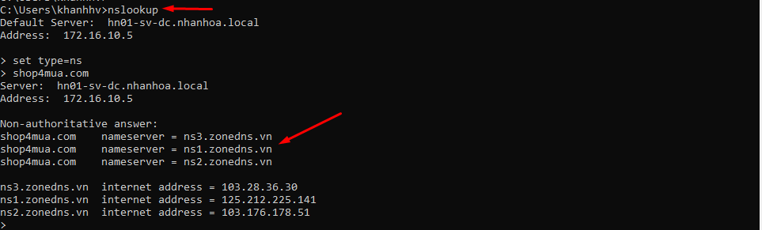
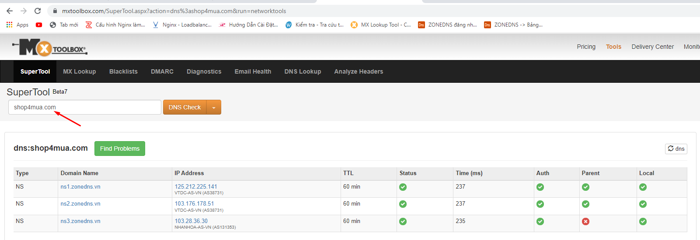
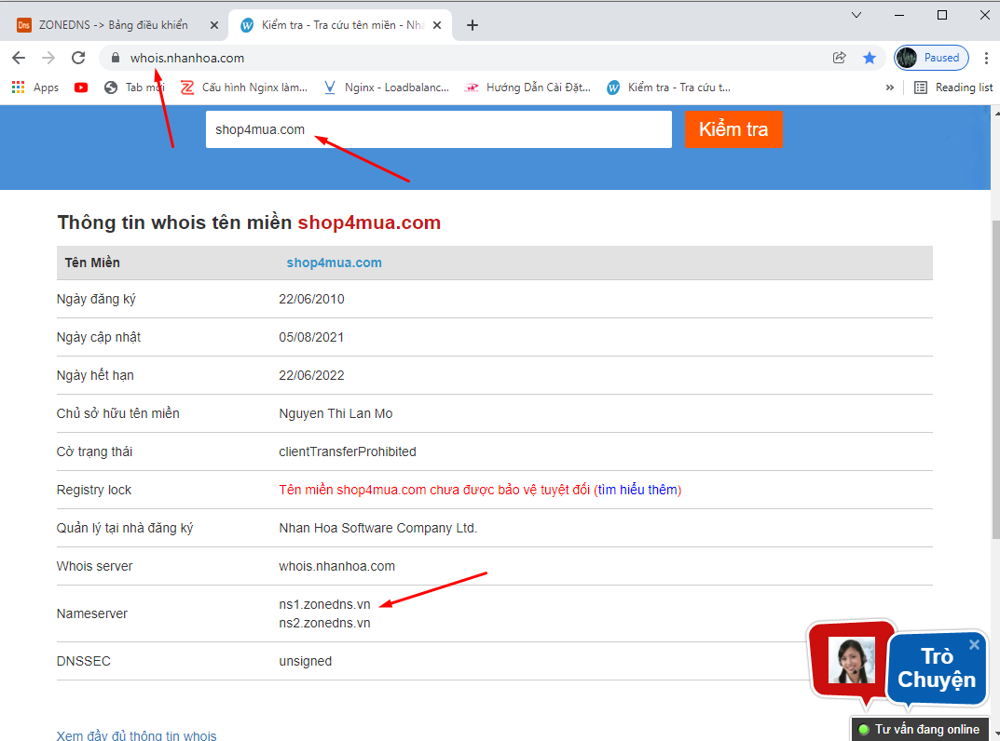

## I.Các cách check xem Domain của đăng ký ở nhân hòa hay không

- địa chỉ DNS phải trỏ về :
	+ ns1.zonedns.vn
	+ ns2.zonedns.vn
	+ ns3.zonedns.vn
	+ ns4.zonedns.vn
	+ 2001.nhanhoa.com.vn
	+ 2002.nhanhoa.com.vn
	+ 2008.nhanhoa.com.vn
	+ 2009.nhanhoa.com.vv

##  Cách 1 : sử dụng công cụ CMD trên laptop
- `nslookup`
- `set type=ns`
    + ns là Domain Name
    + có thể thay ns thành các bản ghi khác để kiểm tra    
- VD : kiểm tra xem trang web shop4mua.com có thuộc DNS của nhân hòa hay không

## cách 2: sử dụng ứng dụng Mxtoolbox.com

## Cách 3: sử dụng Whois.nhanhoa.com

